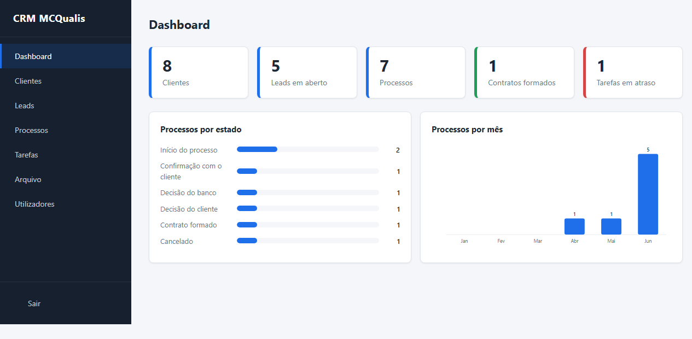
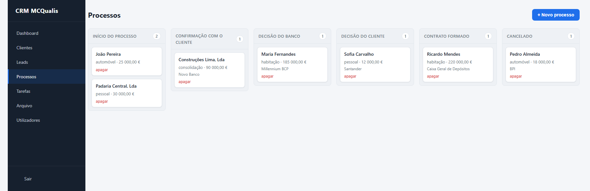
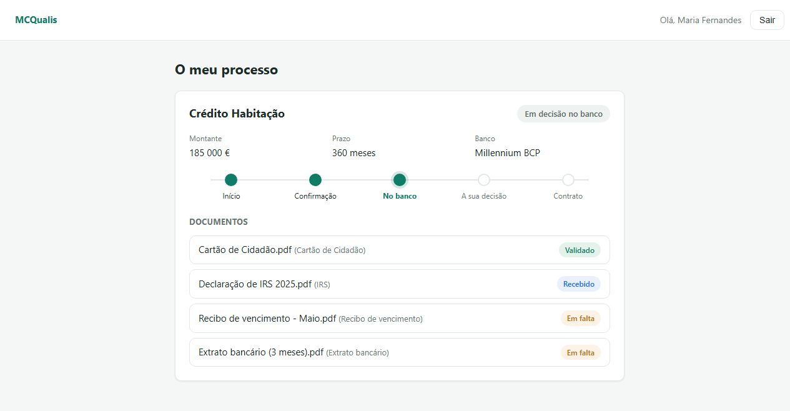
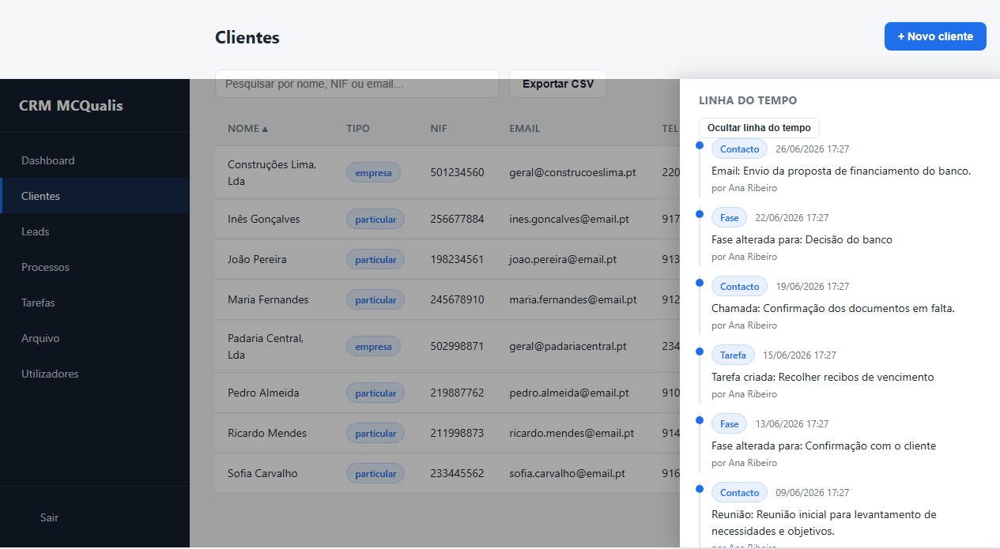

# CRM + Client Portal — Case Study

[Português](README.md) · **English**

An internal CRM and a client portal for a **credit intermediation** company, built from scratch in **PHP/MySQL with no frameworks**. This repository is a case study of the project — the narrative, the decisions and the technical highlights. The source code is private (it is the company's internal tool).

> 🎓 Built by me during my **work placement (FCT)** at MCQualis. End-to-end full-stack work: data model, backend, frontend, UX and security.

---

## 📸 Demo

**Dashboard** — team figures, processes by stage and by month.



| Process funnel (Kanban) | Client portal |
| :---: | :---: |
|  |  |

**Client record with timeline** — every action is recorded with author and date.



<sub>Screenshots use fictitious data.</sub>

---

## 🎯 The problem

A credit intermediation company follows each client through a long journey: from the first contact (*lead*), through building the case, the bank's and the client's decisions, up to the contract. That tracking was scattered, and the **end client** had no way to know where their case stood without calling their consultant.

**Goal:** a single tool that (1) organises the team's work and (2) gives the client a window of transparency over their own process.

---

## 🧩 The solution

Two applications in the same codebase, sharing the database but independent:

- **Internal CRM** (team) — leads, clients, processes, tasks, contacts, history, archive and user management.
- **Client portal** (private, read-only area) — the client follows the status of their process(es), without seeing internal notes or commissions.

### Key features
- **Lead → contract funnel** with conversion: a lead becomes a client + process, and its entire history flows into the process timeline.
- **Process Kanban** with stage changes by drag (desktop) or by selector (phone/tablet).
- **Timeline** per client/process: every action (creation, stage, comment, task, contact) is recorded with author and date.
- **Client portal** by invitation (token), with a simplified stepper view.
- **CSV export** compatible with Excel pt-PT; **automatic archiving** of completed processes.
- **Roles**: admin sees everything; a consultant only their own records.

---

## 🏗️ Architecture

```mermaid
flowchart TD
    subgraph Browser
        A[CRM - index.php shell] -->|fetch fragments + API| B
        P[Portal - index.php] -->|fetch API| B
    end
    B[PHP API - JSON { success, data, error }]
    B --> C[(MySQL / MariaDB)]
    A -. PHPSESSID session .-> S1[Team auth]
    P -. PORTAL_CLIENTE session .-> S2[Client auth]
    S1 --> C
    S2 --> C
```

**Architecture decisions:**
- **Framework-less SPA-lite:** `index.php` is a shell with the navigation; each page is an HTML fragment loaded via `fetch`, with its JS (re)injected on each visit. `api.js`/`comum.js` load once. The result is fluid navigation without the weight (or the build step) of a framework.
- **Two apps, one DB:** the CRM and the portal have **separate** authentication and sessions (`PHPSESSID` vs `PORTAL_CLIENTE`), which makes it possible to expose only the portal to the internet and keep the internal panel closed.
- **API with a uniform envelope** `{ success, data, error }` — the whole frontend talks to the backend the same way.

---

## 🔐 Technical highlights

A few points that show the engineering decisions (illustrative excerpts):

**1. Uniform API contract**, in a single place — every endpoint responds the same way:
```php
function responder(bool $sucesso, $dados = null, ?string $erro = null, int $codigo = 200): void
{
    http_response_code($codigo);
    echo json_encode(['success' => $sucesso, 'data' => $dados, 'error' => $erro]);
    exit;
}
```

**2. CSRF at a single checkpoint** — instead of scattering checks, protection lives in `verificar_auth()`, which every mutation goes through:
```php
if ($api && in_array($_SERVER['REQUEST_METHOD'], ['POST', 'PUT', 'DELETE'], true)) {
    $enviado = $_SERVER['HTTP_X_CSRF_TOKEN'] ?? '';
    if (!hash_equals($_SESSION['csrf'], $enviado)) {
        http_response_code(403); /* ... */ exit;
    }
}
```

**3. Login rate limiting** — stops brute force by counting failures per IP within a short window:
```php
function login_bloqueado(PDO $pdo, string $ip): bool
{
    $stmt = $pdo->prepare(
        'SELECT COUNT(*) FROM login_tentativas
         WHERE ip = :ip AND sucesso = 0
           AND criado_em > (NOW() - INTERVAL 15 MINUTE)'
    );
    $stmt->execute([':ip' => $ip]);
    return (int) $stmt->fetchColumn() >= 5;
}
```

**4. XSS by default** — all dynamic output passes through a central escape before reaching the DOM:
```js
const esc = (v) => String(v ?? '')
    .replace(/&/g, '&amp;').replace(/</g, '&lt;')
    .replace(/>/g, '&gt;').replace(/"/g, '&quot;');
```

Other measures: prepared statements everywhere, sorting via an allow-list, bcrypt password hashing, security headers (CSP/X-Frame-Options), `HttpOnly`/`SameSite`/`Secure` cookies, and a global error handler that never leaks internal details.

---

## 🛠️ Stack
- **Backend:** PHP 8, PDO (prepared statements), endpoint-based architecture.
- **Database:** MySQL / MariaDB (11 tables with foreign keys and deliberate integrity rules — `CASCADE`/`SET NULL` per relationship).
- **Frontend:** vanilla HTML, CSS and JavaScript — responsive, no dependencies.
- **No** build step, bundlers or external libraries.

---

## 💡 What I learned
- Designing a real **relational data model** (referential integrity, what to cascade vs. nullify on delete).
- Building a consistent **API layer** and a dynamic frontend **without** reaching for a framework.
- Thinking about **security** systematically (from SQL/XSS to CSRF, rate limiting and production hardening).
- Separating the **product** (the company's app) from its **presentation** (this case study) — including repository hygiene.

## 🚀 Next steps
Self-service password recovery and automatic invitation by email (both depend on email infrastructure), searchable audit logs and a production deployment (HTTPS, network isolation, backups).

---

<sub>The source code is private as it is the company's internal tool. Happy to walk through it in a conversation.</sub>
